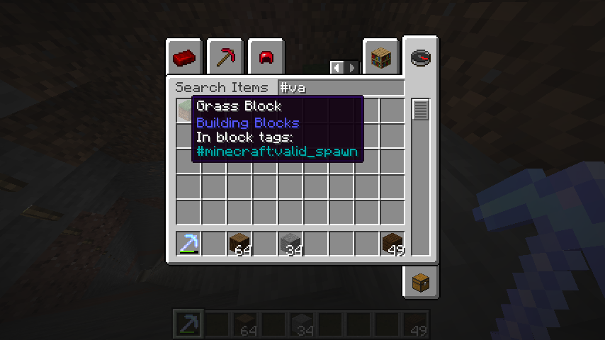
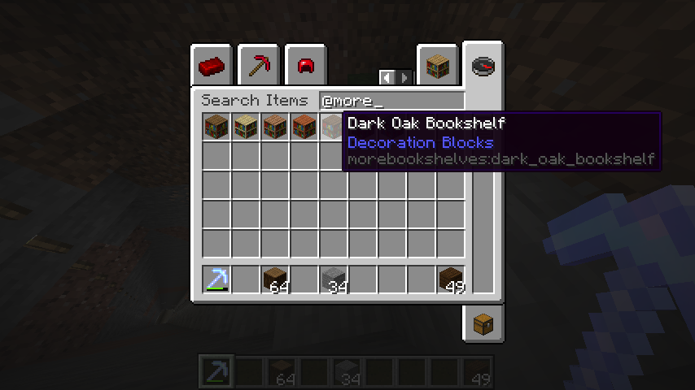
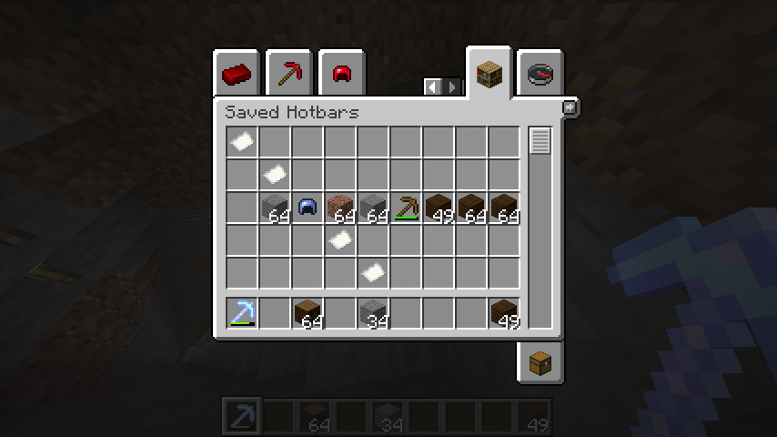
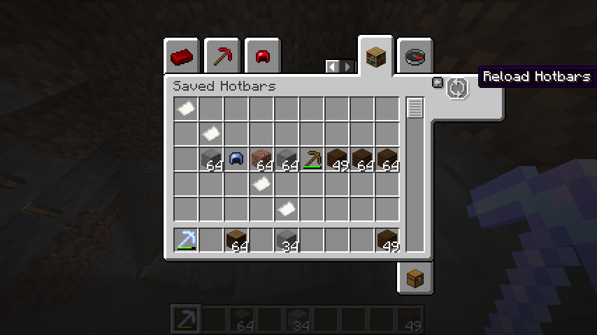

# `Idk`
 ##
  well, the name was chosen because I have no idea what name to chose for it 
  to be of manageable length and convey the purpose of the mod.   
 ## Description
  This is `Idk` a mod that brings some changes to `CreativeInventoryScreen`
  such as:  
  * Block tag search!  
  
---
  * `mod:id` search!  
  
---
  * Reloading hotbars.nbt file!  
  
  
 ## Download
  You can download the mod [here⬇](https://modrinth.com/mod/t9NPLGJk).  
  or build it from sources 🤔?
 ## Todo
  I am planning on adding more features.
  right now those are:
  * add a nbt editor for items in `Saved Hotbars` tab.
  * restructure underlying code to make it ore accessible
 ## Issues
  * if you found any issue please do report it using
  [issues page](https://github.com/lenrik1589/idk/issues)
  but check if issue you are having have not been reported yet.
 
  🧚‍
---